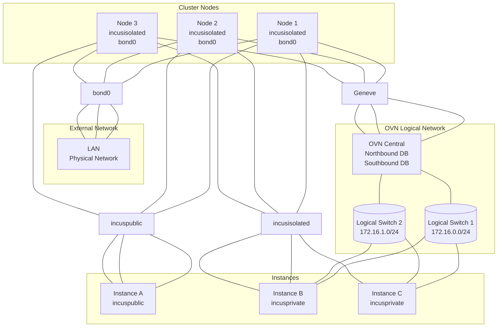
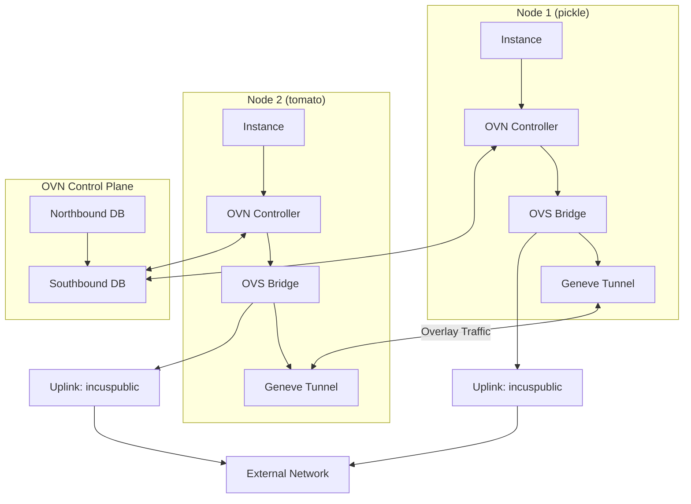

# Incus OVN Network Setup

This guide explains how to configure Incus with OVN (Open Virtual Network) for
cluster-wide software-defined networking.

## Overview

The Incus cluster is configured with three network types:

- **incuspublic**: Bridged to LAN via `bond0` for public-facing instances
- **incusisolated**: Local NAT-only network per node (not cluster-wide)
- **incusprivate**: OVN-based cluster-wide private network (requires manual setup)

## Network Architecture



## Initial OVN Setup

### Step 1: Create OVN Network (Run on ONE cluster node)

After cluster initialization, create the OVN network:

```bash
incus network create incusprivate \
  --type=ovn \
  network=incuspublic \
  ipv4.address=172.16.0.1/24 \
  ipv4.nat=true \
  ipv4.dhcp=true \
  dns.domain=private.incus \
  bridge.mtu=1442
```

### Step 2: Verify Network Creation

```bash
# Check OVN network exists
incus network list

# Should show:
# +--------------+------+---------+
# |     NAME     | TYPE | MANAGED |
# +--------------+------+---------+
# | incuspublic  | bridge | YES   |
# | incusprivate | ovn    | YES   |
# | incusisolated| bridge | YES   |
# +--------------+------+---------+

# View network details
incus network show incusprivate

# Check OVN is operational
incus network list-leases incusprivate
```

## Configuration Reference

### Default OVN Settings

From NixOS configuration (`modules.network.incus.ovnPrivate`):

```nix
ovnPrivate = {
  enable = true;                    # Enable OVN network
  name = "incusprivate";            # Network name
  subnet = "172.16.0.0/24";         # IPv4 subnet
  domain = "private.incus";         # DNS domain
  mtu = 1442;                       # MTU (allows Geneve overhead)
  enableNAT = true;                 # NAT to external via uplink
};
```

### Manual Configuration

If you need to customize the OVN network:

```bash
# Update IPv4 configuration
incus network set incusprivate ipv4.address=172.16.0.1/24

# Enable/disable NAT
incus network set incusprivate ipv4.nat=true

# Configure DNS domain
incus network set incusprivate dns.domain=private.incus

# Set DHCP ranges (optional)
incus network set incusprivate ipv4.dhcp.ranges=172.16.0.50-172.16.0.200

# Configure MTU for Geneve tunnels
incus network set incusprivate bridge.mtu=1442
```

## Usage Examples

### Launch Instance on OVN Network

```bash
# Create instance on cluster-wide private network
incus launch images:nixos/unstable myvm -n incusprivate

# Check instance IP
incus list

# The instance gets an IP from 172.16.0.0/24
```

### Cross-Cluster Communication Test

```bash
# On pickle node
incus launch images:nixos/unstable test-pickle -n incusprivate

# On tomato node
incus launch images:nixos/unstable test-tomato -n incusprivate

# Get IPs
incus list

# Test connectivity from test-pickle to test-tomato
incus exec test-pickle -- ping <test-tomato-ip>
# ✅ Should work! Traffic routed via OVN Geneve tunnels
```

### Create Profile for OVN Network

```bash
# Create profile
incus profile create ovn-private

# Add network device
incus profile device add ovn-private eth0 nic \
  network=incusprivate \
  name=eth0

# Use profile
incus launch images:nixos/unstable myvm -p default -p ovn-private
```

## Network Comparison

| Feature | incuspublic | incusisolated | incusprivate (OVN) |
| :--- | :--- | :--- | :--- |
| **Technology** | Linux Bridge | Linux Bridge | OVN Overlay |
| **Scope** | Cluster-wide | Per-node | Cluster-wide |
| **IP Source** | LAN DHCP | Local DHCP | OVN DHCP |
| **Subnet** | LAN subnet | 10.0.200.0/24 | 172.16.0.0/24 |
| **External Access** | Direct | NAT | NAT via uplink |
| **Cross-node** | ✅ Yes | ❌ No | ✅ Yes |
| **Isolation** | None | Complete | From LAN |
| **Performance** | Best | Good | Good (Geneve) |
| **Use Case** | Production | Testing | Private cluster |

## How OVN Works

Based on [OVN documentation](https://linuxcontainers.org/incus/docs/main/reference/network_ovn/):

1. **Overlay Network**: OVN creates a logical network overlay using Geneve tunnels
2. **Distributed Virtual Switch**: Each node runs OVN controller
3. **Automatic Routing**: Traffic between nodes automatically tunneled
4. **Central Control**: OVN northbound/southbound DBs manage routing
5. **Uplink Network**: Uses `incuspublic` for external connectivity

### OVN Components



## Troubleshooting

### Check OVN Services

```bash
# Check OVN controller status
systemctl status ovn-controller

# Check OVS database
systemctl status ovsdb-server

# View OVN logs
journalctl -u ovn-controller -f
```

### Verify OVN Network

```bash
# Show network configuration
incus network show incusprivate

# Check network state
incus network info incusprivate

# List DHCP leases
incus network list-leases incusprivate

# Test DNS resolution
incus exec <instance> -- nslookup <other-instance>.private.incus
```

### Debug Geneve Tunnels

```bash
# Check Geneve interfaces
ip -d link show type geneve

# Monitor OVN flows
ovs-ofctl dump-flows br-int

# Check OVN northbound database
ovn-nbctl show

# Check OVN southbound database
ovn-sbctl show
```

### Common Issues

**Issue**: Instances can't communicate across nodes

```bash
# Verify Geneve port 6081/udp is open
nft list ruleset | grep 6081

# Check OVN controller is running on all nodes
incus cluster list
systemctl status ovn-controller  # on each node
```

**Issue**: No IP addresses assigned

```bash
# Check DHCP is enabled
incus network get incusprivate ipv4.dhcp

# Restart dnsmasq
systemctl restart incus
```

**Issue**: Can't reach external network

```bash
# Verify uplink is set
incus network get incusprivate network

# Should return: incuspublic

# Check NAT is enabled
incus network get incusprivate ipv4.nat
```

## Advanced Configuration

### Enable IPv6 on OVN

```bash
incus network set incusprivate ipv6.address=fd42::/64
incus network set incusprivate ipv6.nat=true
incus network set incusprivate ipv6.dhcp=true
```

### Configure Network ACLs

```bash
# Create ACL
incus network acl create private-rules

# Add rules
incus network acl rule add private-rules \
  ingress action=allow source=172.16.0.0/24

# Apply to network
incus network set incusprivate security.acls=private-rules
```

### Multiple OVN Networks

You can create additional OVN networks for segmentation:

```bash
# Development network
incus network create incusdev \
  --type=ovn \
  network=incuspublic \
  ipv4.address=172.16.10.1/24 \
  ipv4.nat=true

# Staging network
incus network create incusstaging \
  --type=ovn \
  network=incuspublic \
  ipv4.address=172.16.20.1/24 \
  ipv4.nat=true
```

## References

- [Incus OVN Network Documentation](https://linuxcontainers.org/incus/docs/main/reference/network_ovn/)
- [How to Set Up OVN with Incus](https://linuxcontainers.org/incus/docs/main/howto/network_ovn_setup/)
- [OVN Project](https://www.ovn.org/)
- NixOS Module: `nix/modules/nixos/incus/default.nix`
